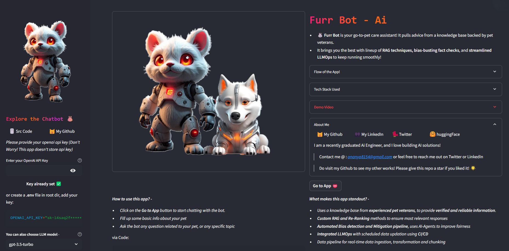
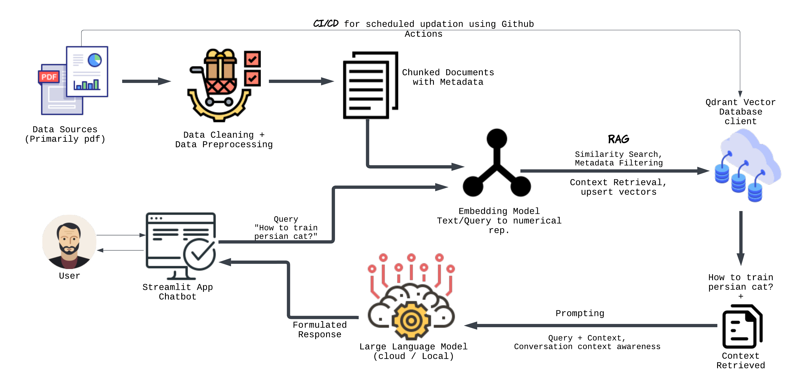

# Furr Bot - AI
A RAG-based Chatbot designed to assist pet care owners, pet veterans with verified and reliable information for their pets! The app sources its knowledge from a database containing pet blogs written by verified pet doctors. Custom Re-Ranking method has been used to filter out the best matches. Integrated CI/CD for scheduled data updation using Github Actions to ensure latest data! Autmated data pipeline to handle data ingestion, pre-processing, chunking and metadata creation tasks. More dynamic and can stay up-to-date because it retrieves current and specific information from its knowledge base, regardless of the model’s training data.

<p align="center">
  
</p>

## Explore  
More dynamic and can stay up-to-date because it retrieves current and specific information from its knowledge base, regardless of the model’s training data. Given below is the list of core feaures integrated in the chatbot!

**Core Features:** 
- Chat about anything related to your pet, being it health, diet, training, grooming, etc.
- More than 18 animal categories (detailed list in raw-data-info.md)
- 200+ Dog breeds, 60+ Cat breeds, 100+ horse breeds, etc
- Prompt tuning to improve answers and context aware conversation
- Real-time data updation using CI/CD
- Bias detection and mitigation using AI-Agents

### Here's a one block code for the Retrieval and Generation module

```python
    from qdrant_client import models, QdrantClient
    from sentence_transformers import SentenceTransformer
    from openai import OpenAI

    # --Retrieval-- 
    client = QdrantClient("#cluster uri here", api_key="#qdrant api here")
    encoder = SentenceTransformer("#embedding model name here")

    # Assuming there is a collection created (with same embedding dimensions) (vectors upserted) 
    hits = client.query_points(
        collection_name="#your collection name",
        query=encoder.encode("#user query").tolist()
        limit=5 # no. of matches
        query_filter=models.Filter(  # optional
              must=[
                  models.FieldCondition(
                      key="word_count",
                      range=models.Range(
                          gte=40 # return paras with min 40 words
                      )
                  )
              ]
        )
    ).points

    responses = []
    for hit in hits:
        hit.payload['score'] = hit.score # get scores
        responses.append(hit.payload
    # responses -> list of best matched paras

    # --Augmentation-- 
    for para in responses:
        context += " " + para.get('text') # use 'text' field for para

    # prompt
    user_query = "# user query"
    prompt = f"""
            Here is some information I retrieved that might help you answer the user's query:
            Context: {context}
            User's query: {user_query}
            Based on the information provided in the context, please provide a comprehensive and informative response to the user's query, ensuring it's accurate, relevant, clear, and engaging.
        """

    # --Generation--
    chat_client = OpenAI(api_key="# api key here")
    answer = chat_client.chat.completions.create(
        model="gpt-3.5-turbo",
        messages=[
                {
                    "role": "system",
                    "content": "Your are a LLM used to improve answers using the context and a query provided"},
                {
                    "role": "user",
                    "content": prompt
                }
            ]
      )
    generated_answer = answer.choices[0].message["content"]
    print(generated_answer) #-> Final improved answer 
```


## Furr Bot Workflow 
Given below is the working flow chart of the app - 
Flow Diagram:
<p align="center">
  
</p>

- **Data pipeline and Pre-processing:** The system begins by collecting data primarily from PDF documents. This data undergoes thorough cleaning and preprocessing to ensure its quality and suitability for further processing. The documents are then chunked into smaller, manageable segments, and metadata is added to each chunk for efficient retrieval and processing.
- **Vector Database and RAG:** The preprocessed documents are converted into vector embeddings using a suitable embedding model. These embeddings are stored in a vector database, such as Qdrant, enabling efficient similarity search. When a user query is received, the system retrieves the most relevant context from the database using techniques like semantic search and keyword matching.
- **Language Model and Response Generation:** A powerful language model, such as a large language model (LLM), is employed to generate human-quality text responses. The model leverages the provided query and relevant context to produce coherent and informative answers.

## How to Use? 
Install the app using pip or an appropriate package installer. The recommended Python version is between 3.11.0 and 3.12. Please set up the repository before use by following the instructions below.

```bash
  git clone https://github.com/ananya868/FurrBot-pet-care-chatbot.git
  cd FurrBot-pet-care-chatbot
  ```
  Create a virtual env, activate and install dependencies: 
  ```bash
  pip install -r requirements.txt
  ```
The app uses either OpenAI or Gemini to generate responses. You can either create a .env file in the root dir and add your openai key as: 
```bash
   OPENAI_API_KEY="sk-14saq2f********"
```
or you can fill the api key in the UI sidebar in streamlit app.

**Note: You can choose not to enter your api key, in the case, Gemini-1.5-flash will be used as default model (You dont have to enter api key for this, its preconfigured)**

  Run the app:
  ```bash
  streamlit run app.py    
```

## File Structure
The file structure is divided into three categories: Streamlit app, data pipelines and Retrieval (vector database) scripts.

- **RAG**
  - **llm.py** : *Script to chat with LLM*
  - **qdrant_database.py** : *query database, upser items, update search method*
- **assets** (contain image vectors for app)
- **chat_history** (chatbot message history)
- **notebooks** (misc notebooks)
- **src** (contain source code for data steps)
  - data_ingestion.py
  - data_extraction.py
  - data_pre_processing.py
  - data_chunking.py
  - metadata_creation.py
- **steps** (scripts to implement data processes)
  - data_ingestion_step.py
  - data_extraction_step.py
  - data_preprocessing_step.py
  - data_chunking_step.py
  - metadata_buildin_step.py
  - save_data_step.py
  - data-pipeline.txt
- **streamlit_src** (scripts for streamlit pages: home, feed)
  - feed_page.py : *script for feed page*
  - home_page.py : *script for home page*
- **vector_database** (json, csv files)
- **Project Components.docx** : Components of the chatbot
- **app.py**
- **chat_page.py** (script for chatbot)(streamlit)
- **data-format.md**
- **raw-data-info.md** (detailed info on raw text data)
- **requirements.txt** 

## Contribution 
Feel free to contribute to this repo! Given below are some potential ways you can contribute to the code, add features, improve performance! 

**1. Add data sources**
- Currently, the app fetches knowledge from a corpus of text blogs scraped from petmd.com. To add more data in the knowledge base, refer to src/data_ingestion.py. You can add methods to ingest data from apis, csvs, json, etc.
- Then, add data extraction script to extract text data from ingested files/sources. You might update data preprocessing methodologies in src/data_pre_processing.py to handle changes in data structure.

**2. Improving Retrieval** 
  - **A. Data**
    - Adding data sources can help improve context, resulting to better results. To improve retrieval, add data sources, implement suitable pre-processing methods, try different chunking methods like Fixed length chunking, Sentence based chunking, Hybrid chunking, etc., add metadata fields to refine re-ranking. **Embedding model used is "all-MiniLM-L6-v2" with dimensions 384**, try out "text-embedding-3-small", "mistral-embed", "models/embedding-001", etc. Refer to [embedding models supported](https://qdrant.tech/documentation/embeddings/?selector=aHRtbCA%2BIGJvZHkgPiBtYWluID4gc2VjdGlvbiA%2BIGRpdiA%2BIGRpdiA%2BIGRpdjpudGgtb2YtdHlwZSgyKSA%2BIGRpdiA%2BIGRpdjpudGgtb2YtdHlwZSgxKSA%2BIGFydGljbGUgPiBoMQ%3D%3D&q=embedding+model#code-samples) for list of supported embedding models by qdrant. Sample code to use "text-embedding-3-small" embedding model (1536 dimensions):

        - ```python
           # Make sure to update collection configuration with embedding model dimensions
           client.update_collection(
               collection_name=collection_name,
               optimizers_config=models.OptimizersConfigDiff(
                   vectors_config=VectorParams(
                       size=1536,
                       distance=Distance.COSINE,
                   ),
           )
           # Search query with updated embedding model 
           client.search(
               collection_name=collection_name,
               query_vector=openai_client.embeddings.create(
                   input=["# Your user query here"],
                   model="text-embedding-3-small",
               )
               .data[0]
               .embedding,
           )
          ``` 

  - **B. Refining Retrieval**
    - You can refine retrieval by testing out different retrieval parameters, number of matches. You can use models.Filter (pass to query_filter) by qdrant to try out various Field Conditions like "must", "must not", "should", "match value", "match text", etc to filter out the best results using metadata. Refer to [filtering](https://qdrant.tech/documentation/concepts/filtering/) for details. Sample code to filter metadata with key and value:
        
        - ```python
           matches = client.query_points(
               collection_name=collection_name,
               query=encoder.encode(query).tolist() # Default Encoder: "all-MiniLM-L6-v2"
               query_filter=models.Filter(
                     models.FieldCondition(
                           key="#Put metadata key",
                           match=models.MatchValue(
                                value="#metadata field value" # for integer
                           )
                )
           )
          ```

**3. Response Generation**
  - **A. Prompts**
    - Propmt tuning, one-shot learning, multi-shot learning, or Automated prompt correction techniques can be    applied to improve chatbot responses. Refer to RAG/llm.py to change current prompt (chatbot).
  - **B. LLM Choice and LLMOps**
    - Currently, the repo utilize cloud based LLMs, Local LLMs can be setup to save costs, extending flexibility of domain-specific language models, even fine-tuning small llms for this specific cases.
    - An Automated LLM Training and Deployment Pipeline can be implemented to streamline the process of training, fine-tuning, evaluating, and deploying models to scale

## Contact 
Feel free to reach me out for collaborations, queries or anything! Also, if you liked the repo, please give a start to this repo! 

- Email: ananya8154@gmail.com
- linkedIn: https://www.linkedin.com/in/ananya8154/


